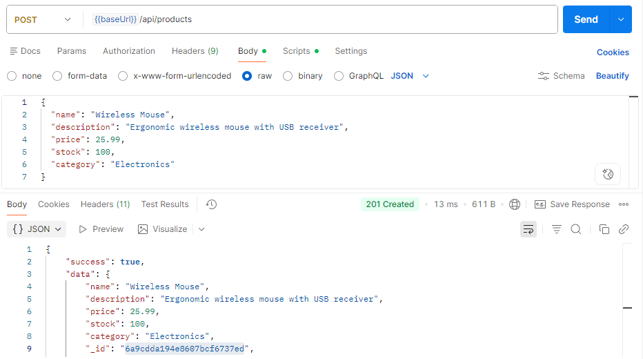
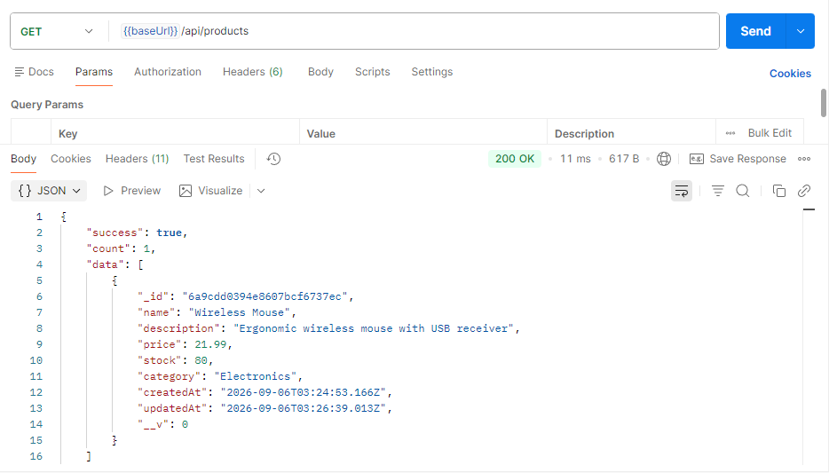
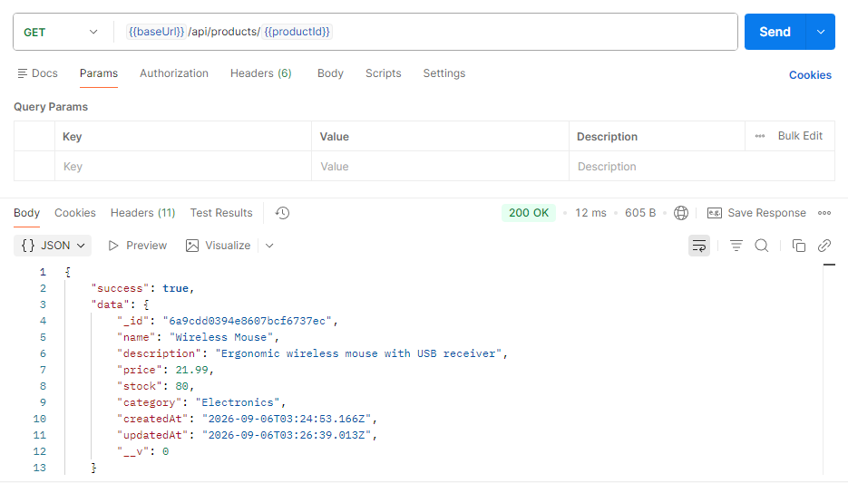
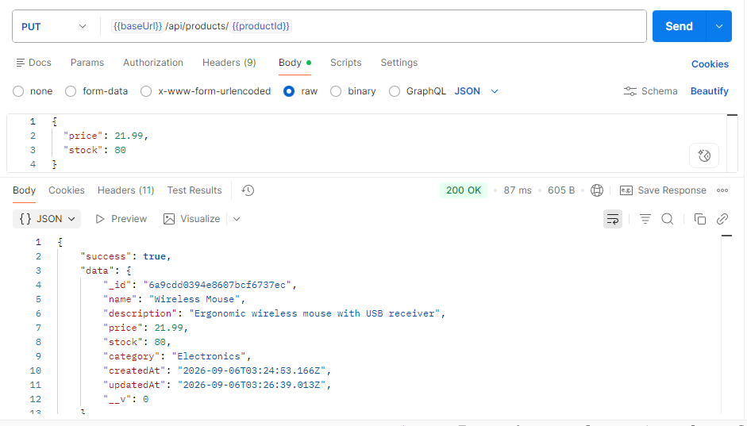
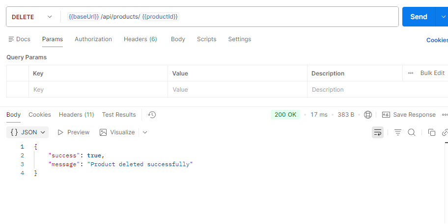
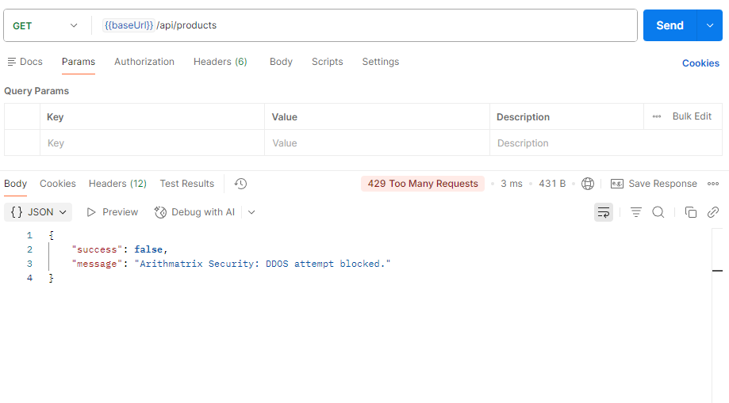

# Product REST API

RESTful API for managing products, built with Node.js, Express, and MongoDB. Developed as part of the Arithmatrix Virtual Internship Program (AVIP 2026) — Backend Development Track, Task 1.

## Features

- Full CRUD operations for products (Create, Read, Update, Delete)
- Input validation using Joi
- Centralized error handling
- Custom API Rate Limiting ("Shield Protocol"): blocks a client after 5 requests per minute
- Clean layered architecture (Controller → Service → Model)
- MongoDB persistence via Mongoose

### Running the Server

```bash
# Development mode (auto-restart on changes)
npm run dev

# Production mode
npm start
```

The server will start on `http://localhost:5000`.

## API Endpoints

Base URL: `http://localhost:5000/api/products`

| Method | Endpoint | Description |
|---|---|---|
| POST | `/api/products` | Create a new product |
| GET | `/api/products` | Get all products |
| GET | `/api/products/:id` | Get a single product by ID |
| PUT | `/api/products/:id` | Update a product by ID |
| DELETE | `/api/products/:id` | Delete a product by ID |

## Sample Requests & Responses

### Create Product (POST)


### Get All Products (GET)


### Get Single Product (GET)


### Update Product (PUT)


### Delete Product (DELETE)


### Rate Limit Triggered (429)

